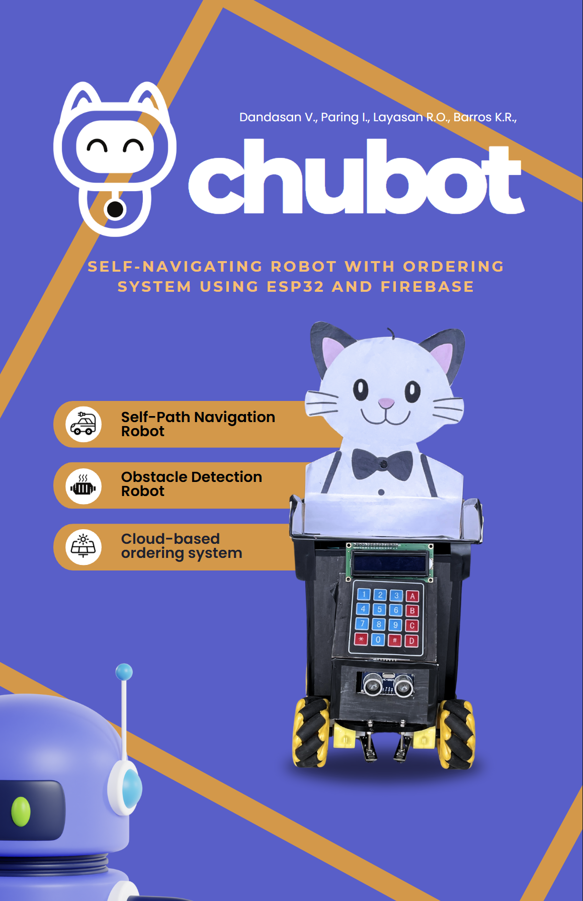

# Chubot-Self-Navigating-Robot-with-Ordering-System-Using-ESP32-and-Firebase-

Manual order-taking in food delivery can lead to delays, errors, and higher costs. To address this, a Restaurant Automation System was developed, featuring an Automated Waiter Robot and Smart Ordering System powered by ESP32. The system automates order-taking and delivery, improving efficiency and accuracy. Testing confirmed reliable path-following and obstacle detection, with issues resolved to enhance performance.
